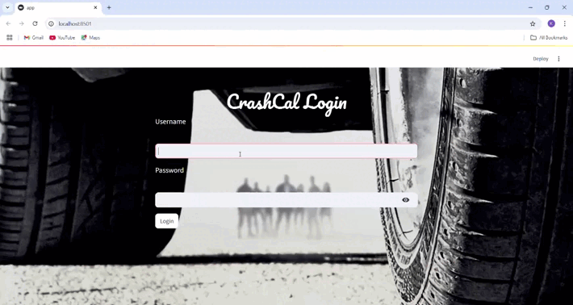
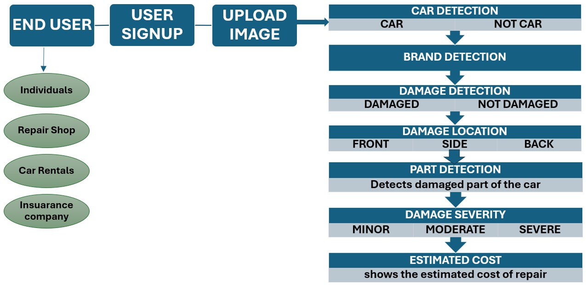

**_Vehicle Damage Assessment Using Computer Vision_**

---

## Demo

---

## 🧭 Table of Contents

- [Project Background](#project-background)
- [Executive Summary](#executive-summary)
- [Objective](#objective)
- [Use Case](#use-case)
- [System Architecture](#system-architecture)
- [Solution Overview](#solution-overview)
- [Model Architecture and Pipeline](#model-architecture-and-pipeline)
- [Tools and Frameworks Used](#tools-and-frameworks-used)
- [Improving the Model](#improving-the-model)
- [Challenges](#challenges)

---

## 🧱 Project Background

Vehicle insurance claims are still primarily processed through manual inspections, in-person paperwork, and subjective assessments. This slows down the process, increases operating costs, and introduces human error.

With the rising availability of high-quality car photos from smartphones and dashcams, there’s an opportunity to automate damage detection and cost estimation using machine learning. CrashCal was created to demonstrate how **Convolutional Neural Networks (CNNs)** and **Computer Vision** can streamline claims processing in the auto insurance sector.

---

## 📌 Executive Summary

**CrashCal** is a vehicle damage assessment tool that automates claims triage using car images. The system uses deep learning to validate whether an image contains a car, identify the car brand, detect and classify visible damage, and estimate repair costs.

This project is a showcase of how computer vision can be used to eliminate manual inefficiencies, accelerate service delivery for vehicle claims.

---

## 🎯 Objective

To develop a deep learning-based solution that accepts a car image and:

- Confirms it's a valid car photo  
- Detects the vehicle brand  
- Determines whether visible damage exists  
- Classifies the damage location and severity  
- Predicts a repair cost estimate

---

## 🚘 Use Case

CrashCal is designed for the following users:

- 🏢 **Insurance Companies** – Speed up claims approvals and reduce manual processing  
- 🔧 **Automobile Workshops** – Pre-diagnose damage and estimate parts cost  
- 👤 **Individual Car Owners** – Get an instant, remote damage report and price estimate

---

## 🖼️ System Architecture

---

## ✅ Solution Overview

CrashCal allows users to upload a photo of their damaged car. The system walks the image through a pipeline of checks to classify, localize, and score the damage:

- Verifies that the image contains a car  
- Detects the **brand** and model of the car  
- Checks if the car has visible damage  
- Classifies the **location** (front, side, or rear)  
- Estimates the **severity** (minor, moderate, severe)  
- Predicts a repair **cost estimate**

This mirrors a real-world workflow but removes the bottlenecks of manual inspection and estimation.

---

## 🏗️ Model Architecture and Pipeline

CrashCal’s model is structured into modular checkpoints:

1. **User Uploads Image** – User submits a car image through the frontend  
2. **Brand Detection** – Identifies the car make/model using a classifier  
3. **Gate 1 – Car Validation** – Ensures the image shows a valid car  
4. **Gate 2 – Damage Detection** – Checks for the presence of visible damage  
5. **Damage Location Classifier** – Classifies damage as front, side, or rear  
6. **Damage Severity Classifier** – Labels the damage as minor, moderate, or severe  
7. **Repair Cost Estimator** – Predicts a repair cost estimate based on location + severity  
8. **Output Report** – Generates structured results for the user and optionally the insurer

---

## 🛠️ Tools and Frameworks Used

### 📦 Data Collection
- Google Images  
- Kaggle Car Damage Datasets  
- Import.io – For image scraping  

### 🧠 Model Development
- TensorFlow & Keras – Deep Learning  
- NumPy – Data arrays and math  
- Scikit-learn – Preprocessing and metrics  

### 🌐 Web Development
- Flask – Python backend server  
- Bootstrap – Frontend UI styling  

### 💻 Development Environment
- Jupyter Notebooks  
- PyCharm  
- Anaconda  

### 📚 Core Python Libraries
- `numpy`, `pandas`, `matplotlib`, `seaborn`, `sklearn`, `pickle`

---

## 🚀 Improving the Model

1. **Brand-specific information** – Using car make/model/year to refine cost prediction to make it more robust
2. **Mobile-Optimized Deployment** – Compress and deploy lightweight versions for on-device inference.  
3. **Cloud Integration** – Scale to production using cloud services (e.g., AWS, GCP).  
4. **Policy Recommendations** – Suggest relevant insurance options post-assessment.  

---

## ⚠️ Challenges

1. **Inconsistent Image Quality** – Differences in angle, lighting, and resolution impact accuracy.  
2. **Lack of Public Datasets** – Few high-quality, labeled datasets for car damage exist.  
3. **Computational Load** – Training on large image sets requires GPU resources and optimization.  
4. **Edge Case Handling** – Rare damage types or unclear images require fallback mechanisms.  
5. **Security & Compliance** – Cloud deployment of financial data must meet data protection standards.  
6. **Fraud Risk** – Logic must detect potentially fake or reused damage photos.

---

